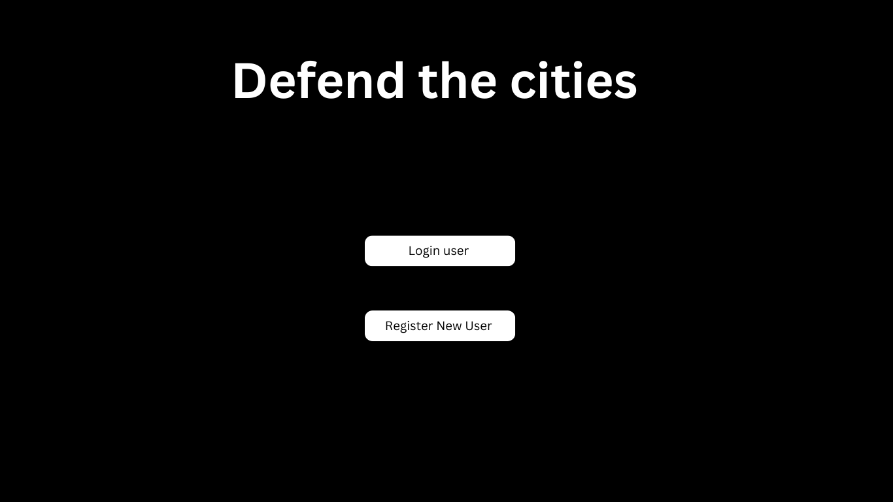
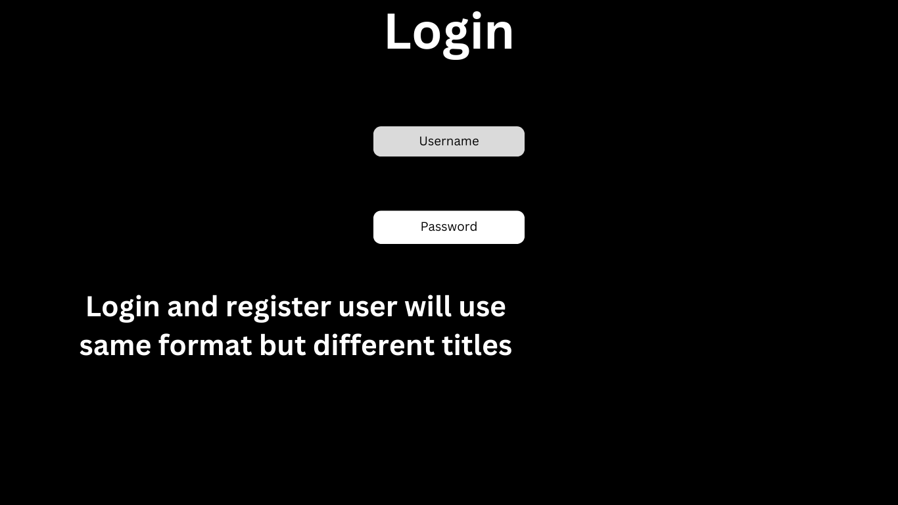
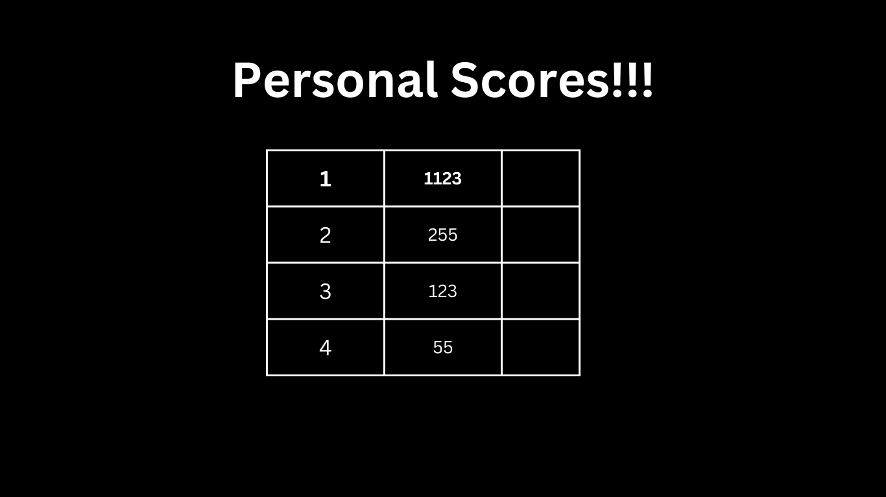
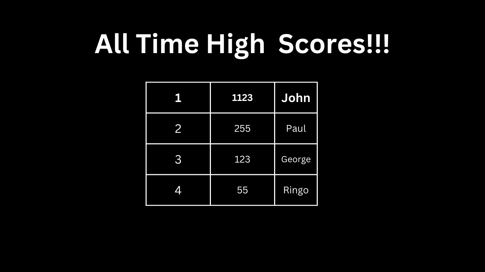
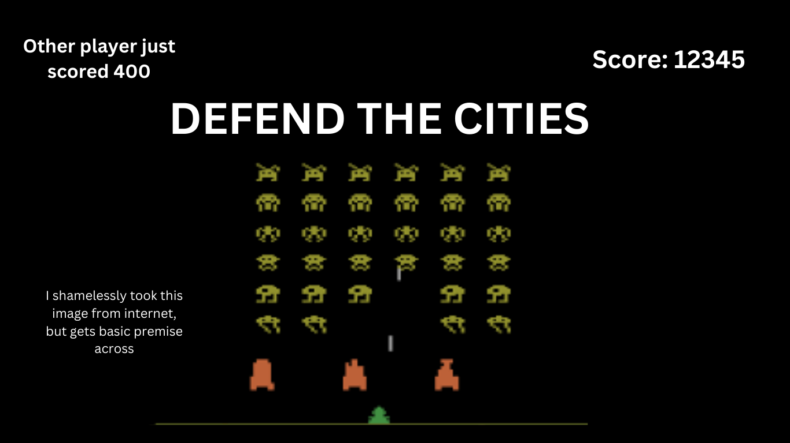
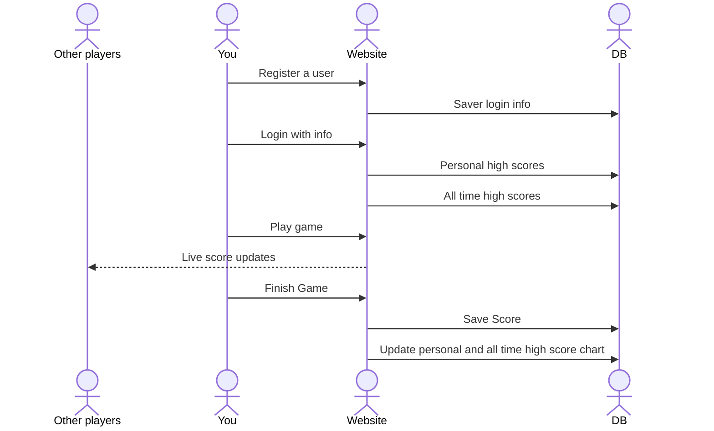

# Defend the Cities

[My Notes](notes.md)

This application is a nostaligic trip back to 1980's arcade games.
Specifically an acarde game called Space Invaders. This is just a simple game where
you control a movable cannon where you shot descending aliens that can shoot back. As the cannon you are defending five cities. if the aliens destroy the cities or the aliens shoot you, you loose. the goal of the game is to survive as long as you can and get the high score.

> [!NOTE]
> This is a template for your startup application. You must modify this `README.md` file for each phase of your development. You only need to fill in the section for each deliverable when that deliverable is submitted in Canvas. Without completing the section for a deliverable, the TA will not know what to look for when grading your submission. Feel free to add additional information to each deliverable description, but make sure you at least have the list of rubric items and a description of what you did for each item.

> [!NOTE]
> If you are not familiar with Markdown then you should review the [documentation](https://docs.github.com/en/get-started/writing-on-github/getting-started-with-writing-and-formatting-on-github/basic-writing-and-formatting-syntax) before continuing.

## 🚀 Specification Deliverable

> [!NOTE]
> Fill in this sections as the submission artifact for this deliverable. You can refer to this [example](https://github.com/webprogramming260/startup-example/blob/main/README.md) for inspiration.

For this deliverable I did the following. I checked the box `[x]` and added a description for things I completed.

- [x] Proper use of Markdown
- [x] A concise and compelling elevator pitch
- [x] Description of key features
- [x] Description of how you will use each technology
- [x] One or more rough sketches of your application. Images must be embedded in this file using Markdown image references.

### Elevator pitch

Have you ever been sitting in class board? Have you been in a meeting that easily could have been an email? Have you ever just wanted a quick easy mindless game to waste time with? Defend the Cities is the application for you. Its a quick mindless fun game that can play for either five minutes or for hours. You can look productive while enjoying your time. You can play whenever where ever you want. You can have unlimited amounts of fun with Defend the Cities!

### Design

Above are some basic images and layouts of the application pages with notes. (It will look nicer then the above images those are just a ruff outline). Below is a basic sequence diagram of how the player, website, db and other users will interact.

### Key features

- The ability to register and log in as a user over HTTPS
- Able to display all time high scores
- Able to display personal scores
- All scores are saved
- Ability to broadcast scores to all players currently playing
- Ability to know when keys are pressed to move character on screen
- Ability to know when a fire key is pressed

### Technologies

I am going to use the required technologies in the following ways.

- **HTML** - I will be using HTML structure for the application. The application will have three pages. A login page, a high score page and a game play page.
- **CSS** - This technology will be used to make sure the application can be played well on many different screen sizes. Alos will be used to animate the movemnt of the aliens and the user. Animate the shots and the cities being defended.
- **React** - I will use react to handling the players key inputs and have it translate to animation. Also to build the ui for login in and registering a user and the state managment of the gameplay. Changeing how the ui looks with key presses and animations.
- **Service** - The backend will have endpoints for login, saving highscores, retriving previous scores. And a public api EmojiHub to get an emoji of an explosion and have it pop up at times.
- **DB/Login** - The DB will store the users and their personal high scores. All top 20 high scores of all time. The login information for the users. And all previous scores from a player. Register and login users.
- **WebSocket** - Live score updates and user names will be broadcasted to all users who are playing a game.

## 🚀 AWS deliverable

For this deliverable I did the following. I checked the box `[x]` and added a description for things I completed.

- [x] **Server deployed and accessible with custom domain name** - [My server link](https://sjredd01.click).

## 🚀 HTML deliverable

For this deliverable I did the following. I checked the box `[x]` and added a description for things I completed.

- [x] **HTML pages** - I have 6 HTML pages representing the home page, register page, login page, personal and all time high score page and gameplay page.
- [x] **Proper HTML element usage** - I used body, nav, header and footer on the index page, and main in the login and registeration pages.
- [x] **Links** - I have links from the index page to the login, register, personal and all time high score page and gameplay pages.
- [x] **Text** - I have the text for the tables and there repective column names. I have text explaining the technologies being implemented (placeholders). And text on the index page as an opening text. Text for the titles of the pages.
- [x] **3rd party API placeholder** - On the gameplay page (defend the cities link) it has a picture of the emoji that will be called from the public api emoji hub. it will come up when you loose a life
- [x] **Images** - I have an image of what the gameplay page will look like and an image of the explosion that will be called. both on the gameplay page.
- [x] **Login placeholder** - I have a page specifically for login
- [x] **DB data placeholder** - I mention where stuff will be entered in the database and when it will be pulled. Gameplay, high score pages, login and register pages
- [x] **WebSocket placeholder** - Every 50 points the username and current points will be shared to all on the webpage over websocket, noted on each page.

## 🚀 CSS deliverable

For this deliverable I did the following. I checked the box `[x]` and added a description for things I completed.

- [x] **Header, footer, and main content body** - I have diffrent styling for the header, footer and main on each page.
- [x] **Navigation elements** - I dropped the underline and made the text white, and when you hover over the links they become bold. The link that has my name in the index.html is bold and has an underline when you hover over it.
- [x] **Responsive to window resizing** - My website looks good in all window sizes and adjusts in a normal looking way.
- [x] **Application elements** - the contrast between the text and the background is good, the space between elements is consestant and nice
- [x] **Application text content** - I have a consestant font across the pages and font sizes for the text, titles, and headers.
- [x] **Application images** - The background is an image of space formatted to fit the screen. On every page.

## 🚀 React part 1: Routing deliverable

For this deliverable I did the following. I checked the box `[x]` and added a description for things I completed.

- [x] **Bundled using Vite** - It is bundled using vite
- [x] **Components** - I mocked login and register components, when you hit login or register it will take you to the gamplay page.The data base is mocked in the all time and personal high score pages, the fake scores will be replaced by ones from the database. The application logic is still mocked by the gameplay image. I mocked the websocket component by having a random name with a random score appear in the top left every 5 seconds, disapearing after 2 seconds I used a use effect function.
- [x] **Router** - I have routing from the home page to the login, register, personal and all time high score and gameplay pages. Their is a route that sends a 404 if you try to go to not a real page. Also the routes go from login, register, personal and all time high score and gameplay pages to all the other pages except home.

## 🚀 React part 2: Reactivity

For this deliverable I did the following. I checked the box `[x]` and added a description for things I completed.

- [x] **All functionality implemented or mocked out** - Everything is mocked out or implemented. The game can be played, scores are saved and pulled in the tables. register and login is mocked out. In the console log it prints "hit" where the api will be called.
- [x] **Hooks** - I used useState and useEffect in the game.jsx

## 🚀 Service deliverable

For this deliverable I did the following. I checked the box `[x]` and added a description for things I completed.

- [x] **Node.js/Express HTTP service** - Done
- [x] **Static middleware for frontend** - Did it
- [x] **Calls to third party endpoints** - Everytime you game over it calls the quote API.
- [x] **Backend service endpoints** - I have backend service endpoints for login and register and saving scores
- [x] **Frontend calls service endpoints** - I use fetch in the game, and in the personal and all time hish score tables.

## 🚀 DB/Login deliverable

For this deliverable I did the following. I checked the box `[x]` and added a description for things I completed.

- [ ] **User registration** - I did not complete this part of the deliverable.
- [ ] **User login and logout** - I did not complete this part of the deliverable.
- [ ] **Stores data in MongoDB** - I did not complete this part of the deliverable.
- [ ] **Stores credentials in MongoDB** - I did not complete this part of the deliverable.
- [ ] **Restricts functionality based on authentication** - I did not complete this part of the deliverable.

## 🚀 WebSocket deliverable

For this deliverable I did the following. I checked the box `[x]` and added a description for things I completed.

- [ ] **Backend listens for WebSocket connection** - I did not complete this part of the deliverable.
- [ ] **Frontend makes WebSocket connection** - I did not complete this part of the deliverable.
- [ ] **Data sent over WebSocket connection** - I did not complete this part of the deliverable.
- [ ] **WebSocket data displayed** - I did not complete this part of the deliverable.
- [ ] **Application is fully functional** - I did not complete this part of the deliverable.
